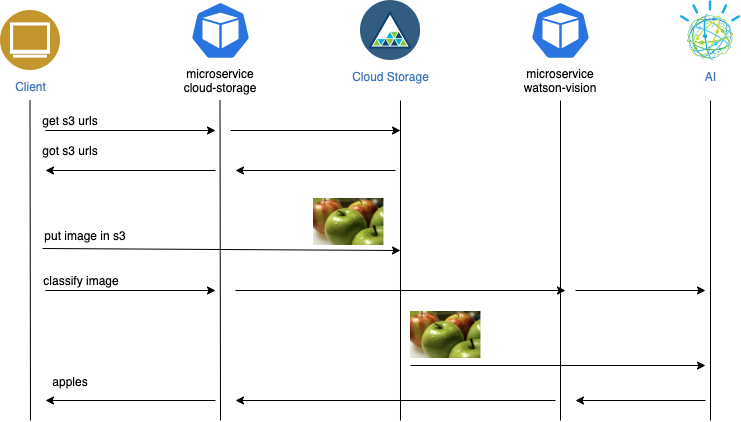

# Cloud Native Principles on IBM Cloud

This git repository contains the code that was used during the live code demo on **IBM Tech TV show Let's Code** shows
- [Cloud Native on IBM Cloud Part 1](https://techtv.bemyapp.com/#/conference/5f1b429ddd40db001b72ed39) Container and Microservices
- [Cloud Native on IBM Cloud Part 2](https://techtv.bemyapp.com/#/conference/5f456a4912951e001bc58803) Observability and ServiceMesh

### Slides
- [./IBM-Tech-TV.pdf](./slides/IBM-Tech-TV.pdf)

### Microservices

### Network Flow
