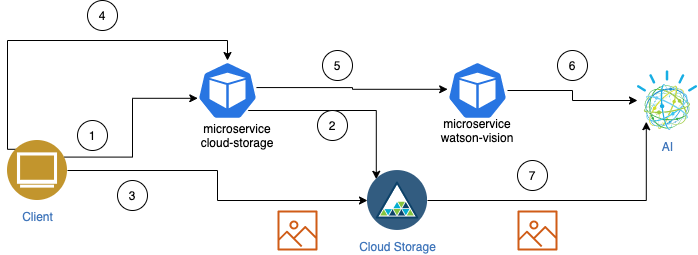

# Cloud Native Principles on IBM Cloud

This git repository contains the code that was used during the presentation on [IBM Tech TV show Let's Code](https://techtv.bemyapp.com/#/conference/5f1b429ddd40db001b72ed39)

Slides [./IBM-Tech-TV.pdf](./slides/IBM-Tech-TV.pdf)

